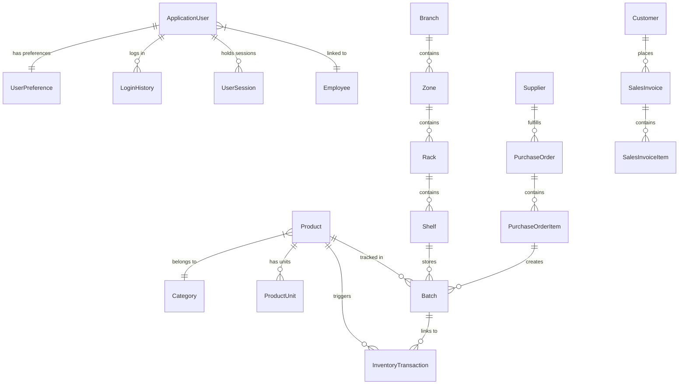

# تقرير حالة المشروع الحالي: نظام إدارة المخزون الذكي (Smart Inventory System)

هذا الملف يحتوي على ملخص شامل ومفصل للحالة الراهنة للمشروع، البنية البرمجية، الميزات المكتملة، والفجوات الحالية التي تتطلب التطوير للاستمرار في العمل بسهولة.

---

## 📌 أولاً: البنية التقنية وهيكل النظام (Architecture & Tech Stack)

يعتمد المشروع على بنية برمجية حديثة وقوية تناسب الأنظمة المؤسسية:
* **إطار العمل الأساسي:** ASP.NET Core MVC (باستخدام C#).
* **قاعدة البيانات:** SQL Server (يستخدم محلياً LocalDB عبر `Server=(localdb)\mssqllocaldb;Database=SmartInventoryDb`).
* **إطار التعامل مع قاعدة البيانات:** Entity Framework Core (نهج Code-First مع وجود هجرات Migrations مسبقة).
* **إدارة الهوية والأمن:** 
  * مكتبة **ASP.NET Core Identity** الافتراضية لإدارة المستخدمين والأدوار.
  * نظام مخصص للأذونات **Permission-based Authorization** (وليس فقط الأدوار التقليدية)، حيث ترتبط الأذونات بالأدوار عبر جدول وسيط ويتم حقن الأذونات كـ Claims للمستخدم عند تسجيل الدخول.
  * إدارة جلسات مخصصة وسحابية بالكامل (`UserSession`) للتحقق من سلامة الجلسة ومنع تعدد الأجهزة أو طرد المستخدمين فورياً عند إيقاف حساباتهم من قبل لوحة الإدارة.
* **الواجهة الرسومية:** 
  * تصميم عصري مبني على **Bootstrap 5** و **Bootstrap Icons**.
  * نظام ترجمة محلي فوري (Client-side translation) يدعم اللغتين **العربية والانجليزية** مع تغيير اتجاه الصفحة تلقائياً (RTL/LTR) وتخزين تفضيلات المستخدم في المتصفح وفي قاعدة البيانات.
  * دعم الوضع المظلم والمضيء (Dark/Light Mode) مع حفظ حالة الثيم المفضل للمستخدم.

---

## ⚙️ ثانياً: بيانات تسجيل الدخول الافتراضية (Default Credentials)

عند تشغيل المشروع لأول مرة، يقوم ملف `SeedData.cs` بتغذية قاعدة البيانات تلقائياً بالبيانات الافتراضية التالية لمدير النظام:

* **البريد الإلكتروني:** `admin@smartinventory.com`
* **اسم المستخدم:** `admin`
* **كلمة المرور:** `Admin@123456`
* **الدور (Role):** `Super Admin` (يمتلك كافة الصلاحيات في النظام).

---

## 🛠️ ثالثاً: حالة المكونات والصفحات المكتملة (Modules Status)

| المكون / الصفحة | الحالة | التفاصيل والوظائف البرمجية المكتملة |
| :--- | :---: | :--- |
| **لوحة التحكم (Dashboard)** | 🟢 يعمل | يعرض بطاقات الأداء المالي والمخزني (إجمالي المنتجات، قيمة المخزون، المنتجات منخفضة المخزون، الطلبات المعلقة، مبيعات اليوم) بالإضافة إلى جدول زمني ديناميكي لأحدث الحركات (Recent Activity). |
| **المنتجات (Products)** | 🟢 يعمل | يدعم عمليات CRUD بالكامل، مع ميزة الأرشفة (Soft Delete) بدلاً من الحذف الفعلي، وإمكانية استرجاع المنتجات المؤرشفة، والتحقق من مرجعية المنتج قبل الحذف النهائي لمنع تعارض البيانات. كما يدعم التصدير إلى ملف CSV. |
| **الفئات (Categories)** | 🟢 يعمل | CRUD كامل لإدارة تصنيفات المنتجات. |
| **الموردين (Suppliers)** | 🟢 يعمل | CRUD كامل للموردين ومعلومات الاتصال بهم. |
| **العملاء (Customers)** | 🟢 يعمل | CRUD كامل للعملاء. |
| **المخزون الحالي (Inventory)** | 🟢 يعمل | يعرض قائمة بجميع دفعات المنتجات (Batches) داخل الرفوف والصفوف. يحتوي على فلاتر تصفية ذكية: (متوفر، نفد، منتهي الصلاحية، ينتهي قريباً خلال 30 يوم، منخفض المخزون) مع إمكانية تصدير البيانات إلى ملف CSV. |
| **سجل الحركات (Inventory History)**| 🟢 يعمل | يعرض سجلاً تاريخياً مدققاً لجميع عمليات الشراء أو البيع والتعديلات التي تمت على المخزون بالتواريخ والكميات والملاحظات المصاحبة. |
| **الطلب الذكي (Smart Reorder)** | 🟢 يعمل | صفحة ذكية تكتشف تلقائياً المنتجات التي وصل مخزونها لمستوى إعادة الطلب أو أقل، وتقترح كمية الشراء المناسبة بناءً على معادلة: `Suggested = (ReorderLevel * 2) - CurrentStock` مع توفير خيار لإنشاء طلب شراء فوري بالكمية المقترحة. |
| **طلبات الشراء (Purchase Orders)** | 🟢 يعمل | يعرض قائمة طلبات الشراء وتفاصيلها. عند إنشاء طلب شراء جديد، يقوم النظام تلقائياً بـ:<br>1. تعيين رقم تسلسلي للطلب تلقائياً.<br>2. التأكد من وجود وحدة قياس صالحة للمنتج.<br>3. إنشاء هيكل مخزني افتراضي (مستودع، زون، رف، رف فرعي) إذا لم يكن موجوداً.<br>4. إضافة المنتجات تلقائياً كدفعة جديدة (Batch) في المخزن وتحديث مستويات المخزون.<br>5. تسجيل عملية الشراء في سجل حركات المخزون. |
| **المبيعات (Sales Invoices)** | 🟢 يعمل | يعرض فواتير المبيعات وتفاصيلها. عند إنشاء فاتورة جديدة، يقوم النظام بخصم الكميات من المخزون بناءً على **سياسة FEFO (منتهي الصلاحية أولاً يُصرف أولاً - First Expiry First Out)** عبر استهلاك الدفعات الأقرب انتهاءً أولاً، مع تسجيل حركة بيع في التاريخ. |
| **الترجمة والثيم (Localization & Themes)**| 🟢 يعمل | نظام متكامل لتغيير اللغات (عربي/إنجليزي) والاتجاهات (RTL/LTR) وتغيير المظهر (مظلم/مضيء) وتخزينها محلياً وحفظها في قاعدة البيانات لكل مستخدم. |

---

## 🔍 رابعاً: الفجوات الحالية وما يجب استكماله (Gaps & Next Steps)

رغم أن البنية التحتية والمنطق البرمجي مكتمل بشكل ممتاز، إلا أن هناك فجوتين رئيسيتين يجب العمل عليهما لاستكمال تشغيل النظام الفعلي بشكل آمن:

### 1. واجهات المستخدم لصفحات الحساب والأمن (Missing Account Views)
* **المشكلة:** مجلد `Views/Account` **غير موجود** في ملفات المشروع! 
* **الأثر:** على الرغم من أن المتحكم `AccountController.cs` مكتوب بالكامل ويحتوي على منطق تسجيل الدخول (`Login`) وتغيير كلمة المرور (`ChangePassword`) والتحقق من الجلسات، إلا أن محاولة الانتقال لصفحة تسجيل الدخول ستفشل بسبب عدم وجود واجهات CSHTML.
* **المطلوب:** إنشاء المجلد `Views/Account` وإضافة الواجهات التالية وتصميمها بنفس الطابع البصري الأنيق للنظام:
  * `Login.cshtml` (صفحة تسجيل الدخول).
  * `ChangePassword.cshtml` (صفحة تغيير كلمة المرور).
  * `AccessDenied.cshtml` (صفحة تم رفض الوصول).

### 2. تفعيل قيود الحماية والأذونات على المتحكمات (Applying Security Attributes)
* **المشكلة:** لا توجد وسوم حماية (`[Authorize]`) أو وسوم التحقق من الصلاحيات المخصصة (`[HasPermission]`) على المتحكمات الحالية (مثل `ProductsController`, `InventoryController`, `PurchaseOrdersController`).
* **الأثر:** النظام حالياً متاح بالكامل للتصفح والتعديل دون الحاجة لتسجيل دخول (لتسهيل التطوير والاختبار).
* **المطلوب:** بعد بناء واجهات تسجيل الدخول، يجب تزيين المتحكمات بالوسم المخصص للحماية بناءً على أذونات المستخدم، مثل:
  ```csharp
  [HasPermission(Permissions.ProductsView)]
  public class ProductsController : Controller { ... }
  ```

---

## 📊 خامساً: هيكل العلاقات بين الكيانات البرمجية (Database ER Diagram)

المخطط التالي يوضح كيفية ترابط الكيانات الرئيسية في قاعدة البيانات لإدارة دورة المخازن والمشتريات والمبيعات:



---

## 🚀 سادساً: كيفية تشغيل واختبار النظام حالياً

بما أن النظام يعمل الآن بالفعل في الخلفية، يمكنك اختباره بالخطوات التالية:
1. **تصفح الواجهة:** اذهب إلى المتصفح وافتح الرابط المحلي للمشروع (الذي يظهر في الكونسول).
2. **تجربة الترجمة والثيم:** جرب الضغط على أزرار الثيم (أيقونة القمر) وتبديل اللغة (زر AR/EN) في الركن العلوي الأيمن من الصفحة الرئيسية؛ ستلاحظ أن كامل لوحة التحكم تتغير اتجاهاتها ونصوصها فورياً ودون الحاجة لإعادة تحميل الصفحة.
3. **دورة المشتريات والمخازن:**
   * اذهب إلى صفحة المنتجات `Products` وأضف منتجاً جديداً وحدد مستوى إعادة الطلب الخاص به (مثلاً: 10 وحدات).
   * اذهب إلى طلبات الشراء `Purchase Orders` وأنشئ طلباً جديداً للمنتج بكمية 15 وحدة. 
   * بمجرد الحفظ، اذهب إلى صفحة المخزون `Inventory` ستجد أن النظام قام تلقائياً بإنشاء دفعة جديدة وتخزينها في "Shelf 1" الافتراضي.
   * اذهب إلى سجل الحركات `Inventory History` ستجد حركة الشراء مسجلة بدقة.
4. **دورة المبيعات:**
   * أنشئ عميلاً جديداً من صفحة العملاء.
   * اذهب إلى فواتير المبيعات `Sales` وأنشئ فاتورة لبيع 5 وحدات من المنتج السابق.
   * احفظ الفاتورة، ثم ارجع لصفحة المخزون لتلاحظ نقص كمية المنتج في الدفعة المعنية لتصبح 10 وحدات بدلاً من 15.
   * اذهب لصفحة الطلب الذكي `Smart Reorder` وستجد أن المنتج لم يظهر بعد لأن مخزونه (10) لم يقل عن مستوى إعادة الطلب (10).
   * جرب بيع وحدة إضافية ليصبح المخزون (9)؛ اذهب لصفحة الطلب الذكي وستجد النظام يقترح فوراً إعادة طلب المنتج مع حساب الكمية المثالية للشراء تلقائياً.
